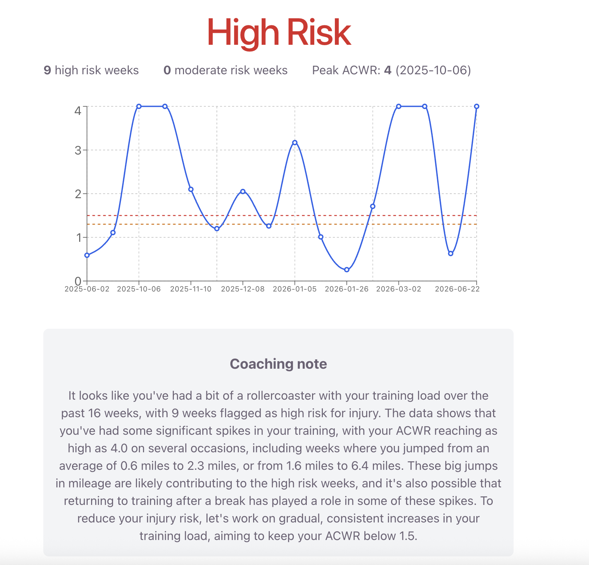
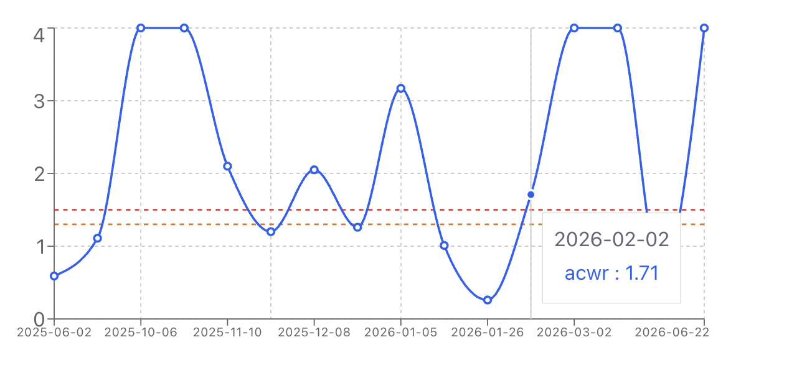

# Strava Overtraining Detector

A tool that connects to your Strava account, analyzes your running history using a real sports-science metric, and generates a plain-English coaching note explaining your injury risk. Powered by an LLM that only interprets pre-computed data, never invents numbers.



## The problem

Runners increase mileage too quickly all the time, often without realizing it, especially after a break from training. This is one of the most common causes of running injuries, and it's largely invisible unless you're tracking it deliberately.

## The approach: ACWR

This tool is built around **Acute:Chronic Workload Ratio (ACWR)**, a published sports-science metric that compares:

- **Acute load** — how much you ran *this week*
- **Chronic load** — your rolling 4-week average

The ratio between the two matters more than absolute mileage. A ratio above **1.3** is a moderate risk zone; above **1.5** is high risk — even if the actual mileage is low. This is why the tool can flag a return from a long break as high-risk even at just a few miles: the spike is *relative* to what the body was recently doing, not an absolute threshold.



## How it works

```
User clicks "Connect Strava"
  → OAuth login via Strava
  → Backend fetches the user's activity history
  → Python computes weekly mileage, fills gaps, calculates ACWR per week
  → Groq (Llama 3.3 70B) reads only the pre-computed numbers and writes a coaching note
  → React dashboard displays the risk summary, timeline chart, and note
```

The LLM never performs any calculation — it only narrates results that were already computed deterministically. This was a deliberate design choice: exact numbers (like ACWR thresholds and peak weeks) need to be guaranteed accurate, not something an LLM could hallucinate.

## Tech stack

- **Backend:** FastAPI (Python) — handles OAuth, orchestrates the pipeline
- **Data source:** Strava API (OAuth 2.0)
- **Metrics engine:** Custom Python — weekly aggregation, gap-filling for training breaks, ACWR calculation
- **LLM:** Groq (Llama 3.3 70B) — generates the natural-language coaching note from pre-computed metrics
- **Frontend:** React (Vite) + Recharts for the timeline visualization

## Running it locally

**Backend:**
```bash
cd backend
pip install -r requirements.txt
python3 -m uvicorn main:app --reload --port 8000
```

**Frontend:**
```bash
cd frontend
npm install
npm run dev
```

You'll need environment variables configured. Copy the example file and fill in your credentials:

```bash
cp .env.example .env
```

Then edit `.env` with your actual values. Get Strava credentials at [strava.com/settings/api](https://www.strava.com/settings/api), and a free Groq key at [console.groq.com](https://console.groq.com).

## A note on Strava API access

As of June 2026, Strava requires an active paid subscription to maintain developer API access. This project was built and tested with a live subscription; if you're viewing this after that subscription has lapsed, the live OAuth flow may no longer be active. The screenshots above and a recorded demo reflect the fully working app.

## Deployment

Deployed with Railway (backend) and Vercel (frontend). The backend uses `BACKEND_URL` and `FRONTEND_URL` environment variables so the same code works both locally and in production. The frontend uses `VITE_BACKEND_URL` to know where to send API requests. Strava's Authorization Callback Domain is set to the Railway domain, since that's the URL Strava actually redirects to.

## What I'd build next

- A "safe mileage range for next week" recommendation, derived from the same ACWR math, to make the tool more forward-looking rather than purely diagnostic
