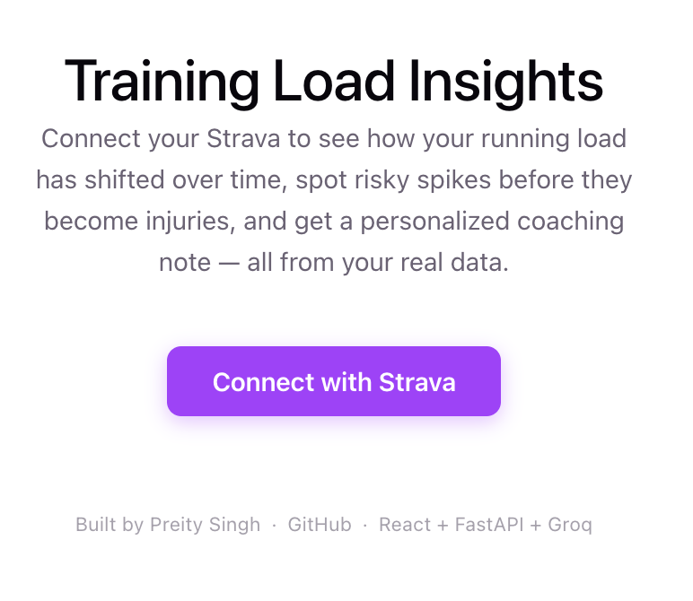
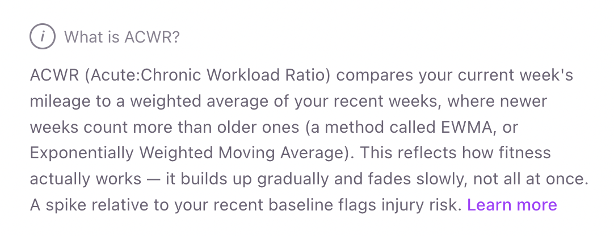
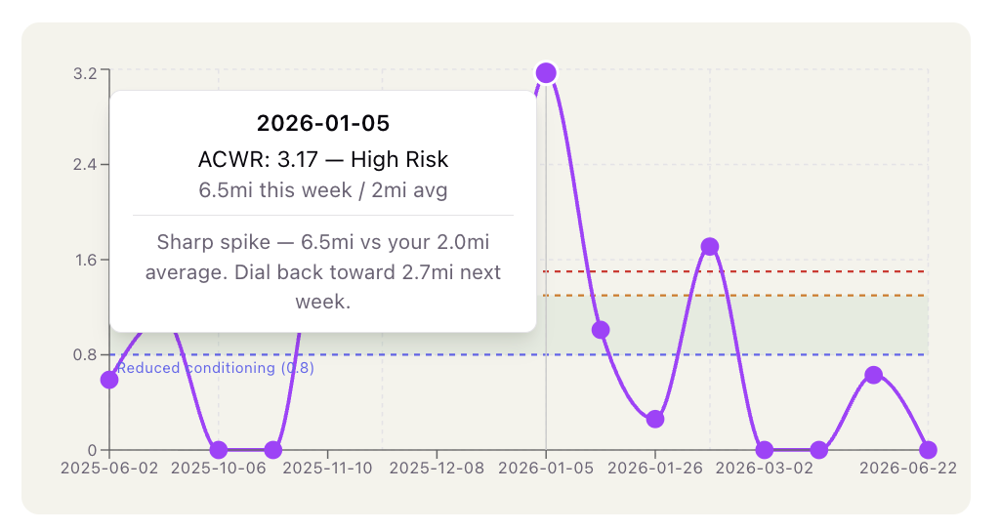
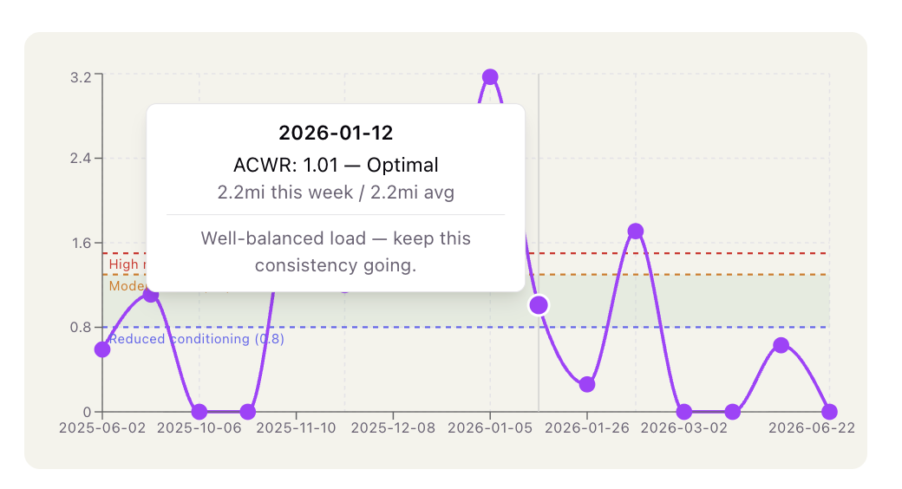
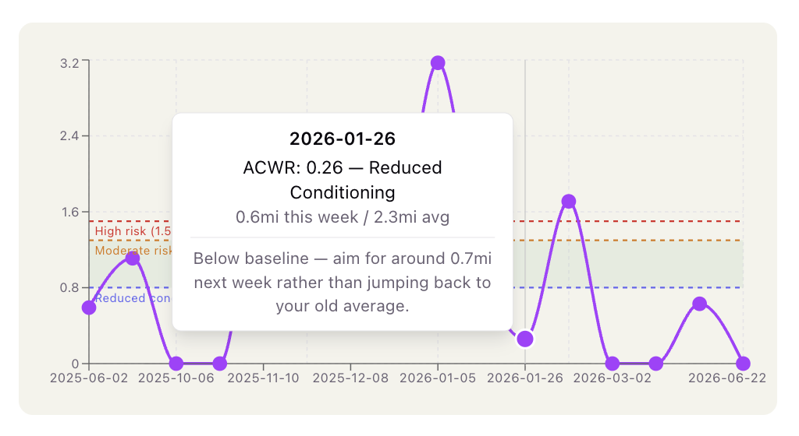
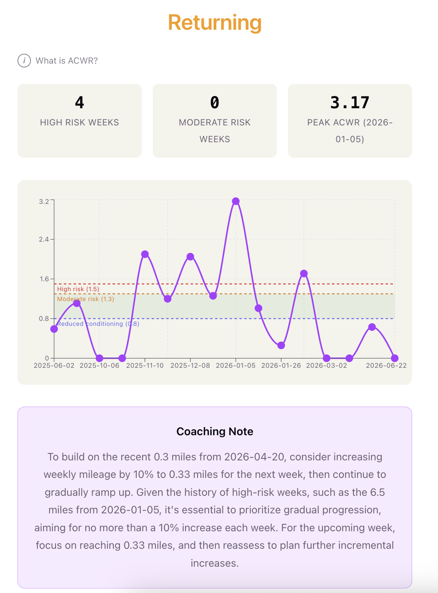
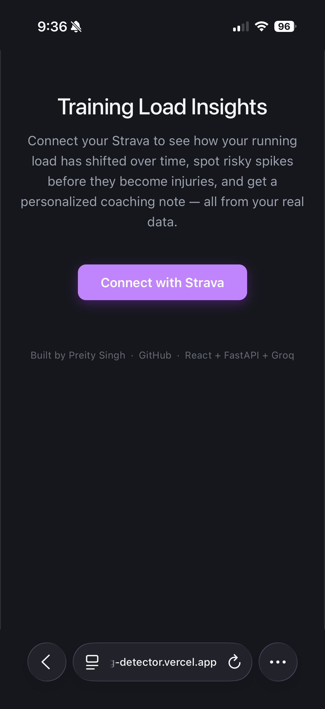
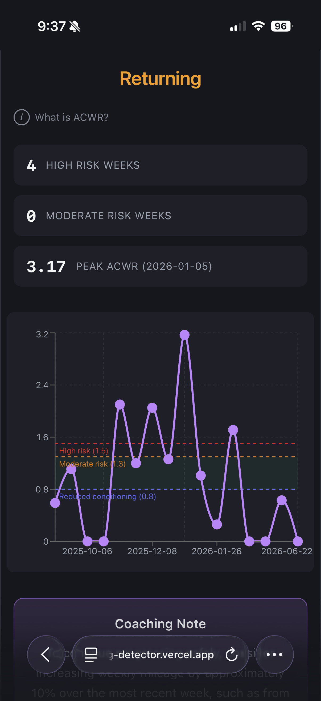
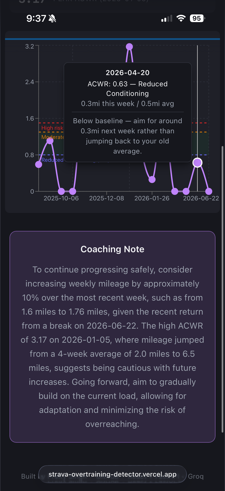

# Training Load Insights

Connect your Strava to see how your running load has shifted over time, spot risky spikes before they become injuries, and get a personalized coaching note — all from your real data.



## The Problem

Runners increase mileage too quickly all the time — often without realizing it, especially after a break. This is one of the most common causes of running injuries, and it's invisible unless you're tracking it deliberately.

## The Approach: ACWR

This tool is built around **Acute:Chronic Workload Ratio (ACWR)**, a sports-science metric that compares your current week's mileage to an exponentially weighted chronic average. Recent weeks count more, old weeks fade gradually (no cliff effect), and a chronic floor of 3mi prevents ratio blow-up for low-volume runners. The ratio matters more than absolute mileage — a spike is relative to what your body has recently been doing.



### Risk Bands

| Band | ACWR | What it means |
|------|------|--------------|
| High Risk | ≥ 1.5 | Sharp spike — significant injury risk |
| Moderate Risk | 1.3 – 1.49 | Load rising faster than ideal |
| Optimal | 0.8 – 1.3 | Well-balanced training |
| Reduced Conditioning | < 0.8 | Below baseline — be gradual if ramping up |

Inactive weeks (0 miles) produce no ratio and appear as gaps in the chart — the chronic average decays during breaks so your first week back is assessed relative to your actual recent baseline, not an inflated one.

### Per-Week Insights

Hover over any data point to see the ACWR value, risk band, mileage context, and a concrete coaching note with specific mileage targets:

| Band | Example |
|------|---------|
| High Risk |  |
| Optimal |  |
| Reduced Conditioning |  |

## Full Dashboard

The dashboard shows your current risk status, summary stats, an interactive ACWR timeline with labeled thresholds and a shaded Optimal zone, and an LLM-generated coaching note with forward-looking guidance.



## How It Works

```
User clicks "Connect with Strava"
  → OAuth login via Strava
  → Backend fetches activity history
  → Python computes weekly mileage, fills gaps, calculates ACWR per week
  → Groq (Llama 3.3 70B) generates a coaching note from the pre-computed data
  → React dashboard displays risk summary, timeline chart, and note
```

The LLM never performs any calculation — it only narrates results that were already computed deterministically. This is intentional: ACWR thresholds and mileage numbers need to be guaranteed accurate, not hallucinated.

## Dark Mode & Mobile

Fully responsive and dark-mode compatible out of the box:

<p align="center">
  
  &nbsp;&nbsp;
  
  &nbsp;&nbsp;
  
</p>

## Tech Stack

- **Backend:** FastAPI (Python) — OAuth, pipeline orchestration
- **Metrics:** Custom Python — weekly aggregation, gap-filling, EWMA-based ACWR with chronic floor
- **LLM:** Groq (Llama 3.3 70B) — coaching note generation from pre-computed metrics
- **Frontend:** React (Vite) + Recharts
- **Deployment:** Vercel (frontend) + Railway (backend)

## Running Locally

**Backend:**
```bash
cd backend
pip install -r requirements.txt
python3 -m uvicorn main:app --reload --port 8000
```

**Frontend:**
```bash
cd frontend
npm install
npm run dev
```

Copy `.env.example` to `.env` and fill in your credentials. Get Strava credentials at [strava.com/settings/api](https://www.strava.com/settings/api) and a free Groq key at [console.groq.com](https://console.groq.com).

## Deployment

Frontend deploys to Vercel, backend to Railway — both auto-deploy on git push. Environment variables:

- Backend (Railway): `STRAVA_CLIENT_ID`, `STRAVA_CLIENT_SECRET`, `GROQ_API_KEY`, `BACKEND_URL`, `FRONTEND_URL`
- Frontend (Vercel): `VITE_BACKEND_URL`

Strava's Authorization Callback Domain points to the Railway domain.

## A Note on Strava API Access

As of June 2026, Strava requires an active paid subscription for developer API access. This project was built and tested with a live subscription. The screenshots and recorded demo reflect the fully working app.

## Why ACWR Over TSB

TSB (Training Stress Balance) is what TrainingPeaks uses — it relies on power/pace zones and workout-level stress scores that require either a power meter or accurate pace data with a known fitness threshold. For casual runners tracking only distance and time, those inputs don't exist without calibration. ACWR works with raw mileage alone, making it accessible to any runner with a GPS watch. The tradeoff is less precision at high performance levels, but for injury-risk detection in recreational runners, the spike-vs-baseline signal is what matters.

## What's Next

- Suggested mileage range for next week (already partially implemented via 10% rule in tooltips)
- Strava API pagination for runners with 200+ activities
- Persistence layer so users don't re-auth every visit

---

Built by [Preity Singh](https://www.linkedin.com/in/preity-singh/) · [GitHub](https://github.com/preity-singh)
